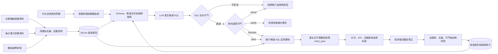

# PowerQuery TW｜台電開放資料 Text2SQL 智慧查詢系統

> 用自然語言探索台灣電力資料，並在回答前先確認資料是否真的足以支持答案。


PowerQuery TW 是一套以 **Text2SQL** 為核心的畢業專題。使用者能直接用中文詢問台電公開資料，系統負責理解問題、產生 SQL、驗證查詢安全性與資料語意，最後以文字、指標、圖表及表格呈現結果。

本專題不只追求「能產生 SQL」，更重視一個實務資料系統應具備的能力：**知道哪些問題可以回答、哪些答案需要揭露限制，以及哪些問題不應產生一個看似合理但其實錯誤的數字。**

> [!IMPORTANT]
> 目前已完成資料清理與對齊、SQLite 語意層、離線／線上 Text2SQL、安全與語意雙守門、評測、API、響應式前端，以及具登入、人工審核、來源追溯、版本切換與稽核紀錄的資料管理。專案可直接在 Windows 本機展示。

## 專題亮點

| 能力面向 | 我們的做法 | 展現的專業能力 |
|---|---|---|
| 自然語言查詢 | 中文問題轉換為受限制的 SQL | LLM 應用、Prompt／Context Engineering |
| 增量語料學習 | 將成功查詢轉成候選語料，通過自動檢查與人工核准後才更新檢索索引 | MLOps、資料治理、Feedback Loop |
| 資料熱插拔 | CSV 先建成不可變候選 DB，人工核准後原子切換，舊查詢不中斷 | 版本管理、可回退發布、稽核 |
| 資料工程 | 寬表轉長表、跨資料集名稱對齊、星狀模型 | ETL、資料建模、資料品質管理 |
| 查詢安全 | 僅允許唯讀查詢，限制資料表、欄位、筆數與執行時間 | SQL AST 驗證、安全設計 |
| 語意治理 | 在執行前判斷問題是否可答，分成拒答、揭露與澄清 | Domain Knowledge、Guardrail 設計 |
| 可重現評測 | 區分語料內／語料外題型，量測執行正確率與守門誤攔率 | AI Evaluation、實驗設計 |
| 視覺化體驗 | 依結果自動選擇圖表、查詢階段回饋、可取消與無障礙設計 | Data Visualization、RWD、Accessibility |

## 我們要解決的問題

一般 Text2SQL 系統可能產生語法正確、可成功執行，卻在領域上完全錯誤的查詢。例如：

```text
使用者：台中電廠去年總發電量是多少？
```

直接對每日資料做 `SUM()` 會得到一個數字，但這個答案至少有兩個問題：

1. 台電資料記錄的是「每日系統尖峰時刻的瞬時出力」，單位為萬瓩，不是每日發電量；跨日加總沒有正確的物理意義。
2. 台中電廠部分氣渦輪機組被收在全系統的殘差欄位，無法從現有資料完整拆回台中電廠總量。

因此，本系統的正確行為不是硬給答案，而是拒絕錯誤計算、說明原因，並建議可被資料支持的替代問法，例如：

```text
「比較 2026 年各月尖峰日的台中燃煤機組出力」
「查詢 2026 年 7 月全系統尖峰負載最高的日期」
```

## 系統設計

以下架構目前已實作；查詢與治理的核心環節都有自動測試與可稽核狀態。



### 雙守門機制

| 守門層 | 檢查內容 | 避免的風險 |
|---|---|---|
| SQL 安全守門 | 唯讀限制、允許清單、SQL AST、查詢筆數及逾時 | 修改資料、任意查詢、資源濫用 |
| 資料語意守門 | 指標定義、單位、時間粒度、資料涵蓋與欄位完整性 | 「SQL 能跑，但答案是錯的」 |

語意守門不採用單一的「通過／拒絕」，而是依風險分級：

- `refuse`：問題會導致錯誤結論，例如把跨日瞬時功率加總成發電量。
- `disclose`：結果仍可參考，但必須顯示資料缺漏或估計限制。
- `clarify`：名稱或日期條件不明確，需要使用者補充後才能查詢。

完整 9 條規則與 SQL 形狀定義請見[專案規格附錄 A](docs/superpowers/specs/2026-09-09-text2sql-taipower-design.md#附錄-a語意守門規則全表)。

### 增量語料學習

系統已建立可追溯的語料更新流程，讓常見新問法與人工修正能逐步改善 Text2SQL 表現：

```text
成功查詢／人工修正
        ↓
候選 question–SQL pair
        ↓
去識別化 → 去重 → SQL 安全驗證 → 語意驗證 → 結果一致性測試
        ↓
staging corpus → 人工核准 → benchmark 回歸通過 → 正式 corpus
        ↓
自動重建 TF-IDF／向量檢索索引並留下版本紀錄
```

這裡的「自動訓練」主要是**自動建立、驗證候選語料，並在人工核准後重建檢索索引**，不是讓模型直接把每次回答當成正確答案。規則路由與線上 LLM 產生的內容一律先停在待審狀態；未經人工核准不得進入正式 corpus，benchmark 也不得成為訓練資料。

### 具審核的資料熱插拔

「資料管理」不是直接覆寫正在使用的 SQLite。上傳、替換、移除或回退都先建立待審異動，後端會驗證 CSV schema 與內容、建立一份新的不可變 DB、執行完整性檢查，最後只有登入的管理員按下核准後才原子切換。核准前查詢仍使用舊版；切換失敗也會自動保留舊版。

目前支援五個受控資料槽：`units_csv`、`daily_csv`、`crosswalk_csv`、`daily_long_csv`、`outage_csv`。其中歲修檔可單獨移除與重新上傳，最適合展示「查得到 → 移除並核准 → 查不到 → 重傳並核准 → 再次查到」；核心日資料具有相依關係，替換時仍會以整體驗證結果決定是否可進待審。系統不接受任意 SQL 或任意 SQLite 上傳，避免繞過查詢白名單與語意層。

每次異動都留下操作者、時間、前後資料版本、檔案 SHA-256、審核結果與理由，事件以 hash chain 串接並由獨立錨點與永久建立標記保護。候選 DB 的 build journal 先綁定來源與輸出 checksum，change mutation journal 確保異動狀態與稽核成對恢復，publish journal 則負責中斷發布；`active.json` 只在不可變來源、資料庫、版本、異動及稽核事件全部落盤後才切換。每次查詢也會把 runtime 與來源追溯綁在同一份已驗證 snapshot，多 worker 會依共享指標同步；若 DB、manifest、稽核或 active pointer 遭竄改則拒絕服務。語料候選會保存建立當下所查詢的 view、資料庫版本與來源檔 checksum，因此資料切版後仍可調閱正確的歷史來源。

### 自動圖表回答

查詢結果除了文字與資料表，也能依欄位型別及問題意圖產生圖表：

| 資料形狀 | 建議圖表 | 適用問題 |
|---|---|---|
| 日期＋數值 | 折線圖 | 尖峰負載或備轉容量的時間趨勢 |
| 類別＋數值 | 長條圖 | 不同機組、燃料或電廠比較 |
| 兩個連續數值 | 散點圖 | 裝置容量與實測最大出力關係 |
| 單一或不適合繪圖的結果 | KPI／資料表 | 最大值、明細或文字型結果 |

後端只產生白名單格式的 `chart_spec`，前端使用 Plotly 渲染；圖表標題、座標軸、單位、資料來源與限制揭露皆須由查詢結果推導。若結果不適合視覺化，系統應誠實回傳 `chart_spec: null`，而不是硬畫一張誤導性圖表。

## 已完成的資料工程成果

我們已將台電「水火力發電廠位置及機組設備」與「過去電力供需資訊」完成跨資料集對齊，並以裝置容量與歷史實測最大值進行客觀驗證，而非只依賴字串相似度。

| 成果 | 數量／結果 |
|---|---:|
| 機組主檔對齊 | **175 台，100% 完成** |
| 每日供需欄位 | 64 個機組／彙總欄位 |
| 可對應機組主檔的欄位 | **43 個（67%）** |
| 轉換後長表 | **36,928 筆** |
| 目前資料期間 | 2025-01-01 ～ 2026-07-31，共 577 天 |
| 已識別資料陷阱 | 10 類 |

其餘 21 個欄位主要屬於核能、民營電廠、汽電共生及再生能源彙總，本來就不在該機組主檔的涵蓋範圍內，並非單純的配對失敗。詳細方法、欄位定義及驗證結果請見 [`taipower_align/README.md`](taipower_align/README.md)。

## 資料模型

系統已以 SQLite 建立星狀模型，將原始資料的複雜欄名與不同粒度轉換成對 LLM 較穩定的語意層：

```text
dim_plant ──< dim_unit ──< bridge_b_column
                              │
                              ▼
                       fact_daily_peak
                              │
                              ├── dim_date
                              └── dim_outage

meta_manifest   資料版本、涵蓋期間與來源
meta_pitfall    已知限制、受影響對象與守門規則依據
v_*             提供給 Text2SQL 的中文語意檢視
```

這個設計將「儲存結構」與「LLM 可見的查詢介面」分離：底層採容易維護的英文欄位與正規化結構，模型只允許查詢經審核的中文 `v_*` views。

## 資料來源

| 台電開放資料 | 用途 | 更新頻率 |
|---|---|---|
| [水火力發電廠位置及機組設備（資料集 8934）](https://data.gov.tw/dataset/8934) | 電廠、機組、燃料、裝置容量與商轉日期 | 不定期 |
| [過去電力供需資訊（資料集 19995）](https://data.gov.tw/dataset/19995) | 每日尖峰負載、備轉容量及尖峰時刻機組出力 | 每月 |
| 機組歲修排程（`d006008`） | 解釋特定機組長時間停機或零出力 | 事件更新 |

> [!WARNING]
> 「過去電力供需資訊」採滾動視窗，只提供上一年度及本年度至上月份資料，舊資料可能被覆蓋。專案需定期封存原始檔，並將資料版本與涵蓋日期寫入 `meta_manifest`，才能維持可重現性。

資料使用遵循「政府資料開放授權條款－第 1 版」。

## 快速開始

需要 Python 3.11 以上與 [uv](https://docs.astral.sh/uv/)。Windows 使用者可直接雙擊根目錄的 `啟動.bat`；它會確認環境、建立必要目錄、在資料庫不存在時自動建庫，待服務就緒後開啟 <http://127.0.0.1:8765/>。服務視窗需保持開啟；按 `Ctrl+C` 即可停止，若 Windows 接著詢問 `Terminate batch job (Y/N)?`，輸入 `Y`。

若要手動啟動，第一次執行：

```powershell
cd "C:\Users\你的帳號\Desktop\text2sql"
uv sync --extra dev --extra online
uv run python -m project_tasks init-dirs
uv run python -m ingest.build_db
uv run powerquery --serve
```

開啟 <http://127.0.0.1:8000> 即可查詢。只使用離線規則時可省略 `--extra online`；線上長尾查詢才需要 OpenAI 套件與 API key。若 8000 被占用，可改用 `uv run powerquery --serve --port 8765`。

Windows 手動重建 `data/processed/power.db` 前，必須先在服務視窗按 `Ctrl+C`；SQLite viewer、OneDrive 或仍在執行的服務可能鎖住檔案。網頁「資料管理」採不可變版本切換，不會覆寫正在使用的 DB，因此展示熱插拔時不需要停止服務。

也可直接使用命令列：

```powershell
uv run powerquery "2026年7月備轉容量率最低是哪一天？"
uv run powerquery --json "天然氣機組共有幾台？"
```

### 資料管理登入與展示

本機展示預設帳號為 `admin`，預設密碼為 `PowerQuery@123`。這是公開的 demo 憑證，只允許 loopback；正式環境必須在啟動前同時覆寫：

```powershell
$env:POWERQUERY_ADMIN_USERNAME="你的管理帳號"
$env:POWERQUERY_ADMIN_PASSWORD="至少八字元的強密碼"
uv run powerquery --serve
```

登入「資料管理」後可依下列流程展示熱插拔：

1. 在「資料檔」對 `outage_csv` 建立移除異動。
2. 到「待審異動」確認 schema、筆數、checksum 與版本，按核准。
3. 回查詢中心詢問「2026年三月有哪些機組在歲修？」；新版 `v_outage` 應無資料。
4. 回資料管理上傳原本或更新後的 UTF-8 `outage.csv`，再核准。
5. 重問同一題，新查詢會立即使用新 DB；「版本」與「稽核」可調閱完整過程，亦可建立需再次審核的回退異動。

要重建名稱對齊與長表衍生檔，可另外執行：

```powershell
cd taipower_align
python align.py
python final.py
```

更多啟動、API、離線／線上模式與治理細節見 [`docs/SERVING.md`](docs/SERVING.md)。

## 評測設計

本專題同時評估「查詢做不做得到」與「系統會不會阻止錯誤答案」，避免只用 SQL 字串相似度美化成果。

| 指標 | 衡量目的 |
|---|---|
| SQL 執行正確率 | 查詢能否執行並得到正確結果 |
| Result Match | 生成 SQL 與標準答案的查詢結果是否一致 |
| 語意陷阱命中率 | 應阻擋或警示的題目是否正確辨識 |
| 守門誤攔率 | 合法問題是否被錯誤拒絕 |
| 語料內／語料外表現 | 區分記憶題型與真正泛化能力 |

驗收基準為：語意陷阱命中率至少 95%、誤攔率不高於 5%，並獨立呈現 `in_corpus=false` 題組結果。目前離線規則基準已達語意陷阱 45/45 命中、20 個合法邊界題 0 誤攔；另以 ablation study 比較移除檢索、對齊資訊與語意守門後的表現差異。

## 專案結構

```text
text2sql/
├── README.md                         # 專案入口
├── 啟動.bat                          # Windows 雙擊啟動與自動開啟網頁
├── docs/                             # 使用、架構、安全、評測與協作文件
├── configs/                          # 資料、LLM、檢索與守門設定
├── scripts/                          # Windows 一鍵啟動輔助工具
├── src/
│   ├── ingest/                       # CSV 驗證與 SQLite 建置
│   ├── align/                        # 名稱、歲修與資料陷阱對齊
│   ├── text2sql/                     # 路由、檢索、LLM、SQL/語意守門
│   ├── eval/                         # 評測與語料晉升回歸關卡
│   └── serving/                      # API、登入、資料治理與前端
├── corpus/                           # 版控中的 canonical 語料與索引
├── benchmarks/                       # 與訓練語料隔離的題庫
├── tests/                            # contract、integration、E2E 測試
├── taipower_align/                   # 已清理、對齊的可重建資料與工具
└── log.md                            # 每個可驗證、可回退的開發儲存點
```

執行期資料庫、候選來源、語料工作區與稽核紀錄位於 gitignored 的 `data/processed/`；公開 GitHub Release 的大型資料包與 checksum 見[台電資料 Release](https://github.com/chenliyu0410/text2sql_project/releases/tag/taipower-data-2026-09-13)。

## 開發里程碑

### 目前進度快照（2026-09-13）

- 專案版本已更新為 `0.3.0`，Phase 1～8 的資料層、Text2SQL、雙守門、評測、API、前端、資料治理與登入均已落地。
- 離線規則可在無 API key 的 Windows 本機完整展示；線上模式可接 OpenAI Responses API，且仍經過相同 SQL／語意護欄。
- 「資料管理」已涵蓋 5 份受控來源、不可變 DB 版本、移除／重傳熱插拔、人工核准、歷史來源下載、回退候選與完整稽核；所有 router／LLM 新語料同樣先停在待人工審核。
- 隔離 E2E 已驗證歲修資料 `138 → 138（僅建立移除候選）→ 0（核准）→ 0（僅建立上傳候選）→ 138（核准）`；實際瀏覽器也完成登入、查詢、來源追溯、語料核准與稽核調閱。
- `uv lock --check`、Ruff、前端 JavaScript 語法、Git whitespace 與 `pytest` 全數通過，目前為 **184 passed**；真實資料工作區亦通過連續兩次重啟驗證。

### 最新四人分工

| 成員 | 主要角色 | 主要範圍摘要 | 下一階段重點 |
|---|---|---|---|
| A | 資料生命週期與熱插拔 | `src/ingest/`、`src/align/`、`taipower_align/`、`src/serving/data_management.py` | 官方快照、schema／checksum、不可變 DB、熱插拔、回退與資料品質 |
| B | Text2SQL、LLM 與語料治理 | `src/text2sql/`（guards 除外）、`src/serving/corpus_learning.py`、`corpus/` | 語料外查詢、offline／online、人工待審語料、來源追溯與索引回歸 |
| C | 安全、登入與獨立評測 | SQL／語意 guards、`src/eval/`、`benchmarks/`、`src/serving/admin_auth.py` | 唯讀／語意防線、auth／CSRF、tamper、promotion gate 與 eval／ablation |
| D | API、runtime、前端與發布 | `runtime.py`、`app.py`、`presentation.py`、`static/`、契約／CI／文件 | 跨模組整合、桌機／手機展示、多 worker 一致性與 GitHub Release |

D 兼任 Integration Owner；跨模組改動仍由原 Module Owner 審查。可直接交給 AI 使用的完整角色 Prompt、驗收指令與交接格式見 [`docs/TEAM_4_ROLES.md`](docs/TEAM_4_ROLES.md)。

| 階段 | 內容 | 狀態 |
|---|---|:---:|
| Phase 1 | 原始資料盤點、下載與版本管理 | ✅ |
| Phase 2 | 名稱對齊、長表轉換與資料陷阱分析 | ✅ |
| Phase 3 | SQLite 星狀模型與中文語意檢視 | ✅ |
| Phase 4 | Text2SQL 生成、檢索、失敗重試與增量語料索引 | ✅ |
| Phase 5 | SQL 安全守門與資料語意守門 | ✅ |
| Phase 6 | 題庫、語料晉升閘門、離線評測與 ablation study | ✅ |
| Phase 7 | FastAPI、對話式介面與自動圖表回答 | ✅ |
| Phase 8 | 資料熱插拔、登入、人工審核、來源追溯與稽核 | ✅ |

## 已知限制

- 現有每日資料只能回答尖峰時刻的功率問題，不能回答發電量、用電度數、成本、電價或碳排。
- 2025 年 1 月以前沒有目前這套機組明細；逐時或每 10 分鐘曲線也尚未納入。
- 6 座電廠的部分機組被收在殘差欄位，無法還原完整的電廠級總出力。
- 核能、IPP、汽電共生與再生能源彙總欄位缺少相同粒度的機組主檔。
- 台電不同資料集存在多套機組命名方式，新增資料源時必須重新驗證對齊規則。

主動揭露限制不是功能缺陷，而是本專題「可信任 Text2SQL」設計的一部分。

## 團隊協作與文件

- [完整系統規格](docs/superpowers/specs/2026-09-09-text2sql-taipower-design.md)
- [啟動、登入與資料管理操作](docs/SERVING.md)
- [資料字典](docs/DATA_DICTIONARY.md)
- [Text2SQL 管線契約](docs/TEXT2SQL_PIPELINE.md)
- [語意守門契約](docs/SEMANTIC_GUARD.md)
- [離線評測說明](docs/EVALUATION.md)
- [系統能力與限制](docs/SYSTEM_CARD.md)
- [資料對齊方法與驗證結果](taipower_align/README.md)
- [後端 API 契約](src/serving/API_CONTRACT.md)
- [新版四人分工與可直接使用的 AI Prompt](docs/TEAM_4_ROLES.md)
- [可回退開發進度](log.md)

---

本專題以 **資料工程 × LLM 應用 × 軟體安全 × AI 評測 × 使用者體驗** 為核心，目標不是展示一個會產生 SQL 的聊天機器人，而是打造一個能對資料負責、對答案誠實的自然語言查詢系統。
