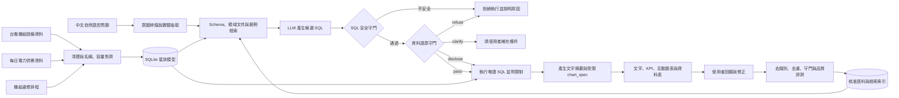

# PowerQuery TW｜台電開放資料 Text2SQL 智慧查詢系統

> 用自然語言探索台灣電力資料，並在回答前先確認資料是否真的足以支持答案。


## 線上展示｜直接試用

**[開啟 PowerQuery TW 公開展示](https://p215-2203-nb01.tail177cc6.ts.net:8443/)**

訪客不需登入，也不需提供 API key。開啟後可在「查詢中心」點選範例問句，或輸入「天然氣機組共有幾台？」試查；也可瀏覽資料總覽、圖表和查詢結果。公開展示預設使用離線規則路由與唯讀 SQL 查詢，未涵蓋的問題會說明限制，不代表線上 LLM 的生成能力。此網址由專案電腦透過 Tailscale Funnel 提供；電腦休眠、關機或網路中斷時會暫時無法連線。

PowerQuery TW 是一套以 **Text2SQL** 為核心的畢業專題。使用者能直接用中文詢問台電公開資料，系統負責理解問題、產生 SQL、驗證查詢安全性與資料語意，最後以文字、指標、圖表及表格呈現結果。

本專題不只追求「能產生 SQL」，更重視一個實務資料系統應具備的能力：**知道哪些問題可以回答、哪些答案需要揭露限制，以及哪些問題不應產生一個看似合理但其實錯誤的數字。**

> [!IMPORTANT]
> 目前已實作資料清理與對齊、SQLite 語意檢視、受限 Text2SQL 查詢管線、FastAPI 與網頁工作台，並提供公開離線展示。離線模式使用已審核的確定性規則；線上 LLM 是可選模式，需要另外設定 API key。下文的系統設計也保留尚待擴充的方向。

## 專題亮點

| 能力面向 | 我們的做法 | 展現的專業能力 |
|---|---|---|
| 自然語言查詢 | 中文問題轉換為受限制的 SQL | LLM 應用、Prompt／Context Engineering |
| 增量語料學習 | 將成功查詢與人工修正轉成候選語料，驗證後自動更新檢索索引 | MLOps、資料治理、Feedback Loop |
| 資料工程 | 寬表轉長表、跨資料集名稱對齊、星狀模型 | ETL、資料建模、資料品質管理 |
| 查詢安全 | 僅允許唯讀查詢，限制資料表、欄位、筆數與執行時間 | SQL AST 驗證、安全設計 |
| 語意治理 | 在執行前判斷問題是否可答，分成拒答、揭露與澄清 | Domain Knowledge、Guardrail 設計 |
| 可重現評測 | 區分語料內／語料外題型，量測執行正確率與守門誤攔率 | AI Evaluation、實驗設計 |
| 視覺化體驗 | 依結果自動選擇圖表、查詢階段回饋、可取消與無障礙設計 | Data Visualization、RWD、Accessibility |

## 我們要解決的問題

一般 Text2SQL 系統可能產生語法正確、可成功執行，卻在領域上完全錯誤的查詢。例如：

```text
使用者：台中電廠去年總發電量是多少？
```

直接對每日資料做 `SUM()` 會得到一個數字，但這個答案至少有兩個問題：

1. 台電資料記錄的是「每日系統尖峰時刻的瞬時出力」，單位為萬瓩，不是每日發電量；跨日加總沒有正確的物理意義。
2. 台中電廠部分氣渦輪機組被收在全系統的殘差欄位，無法從現有資料完整拆回台中電廠總量。

因此，本系統的正確行為不是硬給答案，而是拒絕錯誤計算、說明原因，並建議可被資料支持的替代問法，例如：

```text
「比較 2026 年各月尖峰日的台中燃煤機組出力」
「查詢 2026 年 7 月全系統尖峰負載最高的日期」
```

## 系統設計

以下為系統架構與持續擴充的目標流程。資料擷取／清理、名稱與容量對齊、SQLite 語意檢視、查詢守門及網頁工作台已有實作；部分資料來源和線上模型能力仍依可取得的資料與設定逐步擴充。



### 雙守門機制

| 守門層 | 檢查內容 | 避免的風險 |
|---|---|---|
| SQL 安全守門 | 唯讀限制、允許清單、SQL AST、查詢筆數及逾時 | 修改資料、任意查詢、資源濫用 |
| 資料語意守門 | 指標定義、單位、時間粒度、資料涵蓋與欄位完整性 | 「SQL 能跑，但答案是錯的」 |

語意守門不採用單一的「通過／拒絕」，而是依風險分級：

- `refuse`：問題會導致錯誤結論，例如把跨日瞬時功率加總成發電量。
- `disclose`：結果仍可參考，但必須顯示資料缺漏或估計限制。
- `clarify`：名稱或日期條件不明確，需要使用者補充後才能查詢。

完整 9 條規則與 SQL 形狀定義請見[專案規格附錄 A](docs/superpowers/specs/2026-09-09-text2sql-taipower-design.md#附錄-a語意守門規則全表)。

### 增量語料學習

系統已建立可追溯的候選語料與驗證流程，讓常見新問法與人工修正能逐步改善 Text2SQL 表現：

```text
成功查詢／人工修正
        ↓
候選 question–SQL pair
        ↓
去識別化 → 去重 → SQL 安全驗證 → 語意驗證 → 結果一致性測試
        ↓
staging corpus → benchmark 回歸通過 → 正式 corpus
        ↓
自動重建 TF-IDF／向量檢索索引並留下版本紀錄
```

這裡的「自動訓練」主要是**自動擴充高品質語料並重建檢索索引**，不是讓模型直接把每次回答當成正確答案。未經驗證的查詢不得進入正式 corpus，benchmark 也不得成為訓練資料，以防止錯誤累積與評測洩漏。

### 自動圖表回答

查詢結果除了文字與資料表，也能依欄位型別及問題意圖產生圖表：

| 資料形狀 | 建議圖表 | 適用問題 |
|---|---|---|
| 日期＋數值 | 折線圖 | 尖峰負載或備轉容量的時間趨勢 |
| 類別＋數值 | 長條圖 | 不同機組、燃料或電廠比較 |
| 兩個連續數值 | 散點圖 | 裝置容量與實測最大出力關係 |
| 單一或不適合繪圖的結果 | KPI／資料表 | 最大值、明細或文字型結果 |

後端只產生白名單格式的 `chart_spec`，前端使用 Plotly 渲染；圖表標題、座標軸、單位、資料來源與限制揭露皆須由查詢結果推導。若結果不適合視覺化，系統應誠實回傳 `chart_spec: null`，而不是硬畫一張誤導性圖表。

## 已完成的資料工程成果

我們已將台電「水火力發電廠位置及機組設備」與「過去電力供需資訊」完成跨資料集對齊，並以裝置容量與歷史實測最大值進行客觀驗證，而非只依賴字串相似度。

| 成果 | 數量／結果 |
|---|---:|
| 機組主檔對齊 | **175 台，100% 完成** |
| 每日供需欄位 | 64 個機組／彙總欄位 |
| 可對應機組主檔的欄位 | **43 個（67%）** |
| 轉換後長表 | **36,928 筆** |
| 目前資料期間 | 2025-01-01 ～ 2026-07-31，共 577 天 |
| 已識別資料陷阱 | 10 類 |

其餘 21 個欄位主要屬於核能、民營電廠、汽電共生及再生能源彙總，本來就不在該機組主檔的涵蓋範圍內，並非單純的配對失敗。詳細方法、欄位定義及驗證結果請見 [`taipower_align/README.md`](taipower_align/README.md)。

## 資料模型

系統以 SQLite 建立星狀模型，將原始資料的複雜欄名與不同粒度轉換成較穩定的語意層：

```text
dim_plant ──< dim_unit ──< bridge_b_column
                              │
                              ▼
                       fact_daily_peak
                              │
                              ├── dim_date
                              └── dim_outage

meta_manifest   資料版本、涵蓋期間與來源
meta_pitfall    已知限制、受影響對象與守門規則依據
v_*             提供給 Text2SQL 的中文語意檢視
```

這個設計將「儲存結構」與「LLM 可見的查詢介面」分離：底層採容易維護的英文欄位與正規化結構，模型只允許查詢經審核的中文 `v_*` views。

## 資料來源

| 台電開放資料 | 用途 | 更新頻率 |
|---|---|---|
| [水火力發電廠位置及機組設備（資料集 8934）](https://data.gov.tw/dataset/8934) | 電廠、機組、燃料、裝置容量與商轉日期 | 不定期 |
| [過去電力供需資訊（資料集 19995）](https://data.gov.tw/dataset/19995) | 每日尖峰負載、備轉容量及尖峰時刻機組出力 | 每月 |
| 機組歲修排程（`d006008`） | 解釋特定機組長時間停機或零出力 | 事件更新 |

> [!WARNING]
> 「過去電力供需資訊」採滾動視窗，只提供上一年度及本年度至上月份資料，舊資料可能被覆蓋。專案需定期封存原始檔，並將資料版本與涵蓋日期寫入 `meta_manifest`，才能維持可重現性。

資料使用遵循「政府資料開放授權條款－第 1 版」。

## 快速開始：本機試用與重現資料對齊

若只想看專案，直接使用上方的[公開展示](https://p215-2203-nb01.tail177cc6.ts.net:8443/)。本機執行完整網頁工作台需要 Python 3.11 以上、`uv`、專案依賴與 SQLite 資料快照；啟動步驟見[使用方式](SERVING.md)。

只重現資料對齊成果時，`taipower_align` 流程使用 Python 標準函式庫，不需額外安裝套件。

```bash
cd taipower_align
python align.py    # 建立 crosswalk.csv 與人讀版驗證報告
python final.py    # 將每日寬表轉為 daily_long.csv，執行語意驗證
```

如需從官方來源更新資料：

```bash
python fetch.py
python fetch.py --extra   # 額外下載備轉容量、歲修排程等資料
```

執行後的重要產物：

| 檔案 | 說明 |
|---|---|
| `taipower_align/crosswalk.csv` | 台電兩套命名系統的欄位與機組對照表 |
| `taipower_align/daily_long.csv` | 每日供需寬表轉換後的分析用長表 |
| `taipower_align/crosswalk.txt` | 容量比值、未對應欄位與異常警示 |
| `taipower_align/final.txt` | 語意驗證、缺漏機組與欄位分類 |

## 評測設計

本專題同時評估「查詢做不做得到」與「系統會不會阻止錯誤答案」，避免只用 SQL 字串相似度美化成果。

| 指標 | 衡量目的 |
|---|---|
| SQL 執行正確率 | 查詢能否執行並得到正確結果 |
| Result Match | 生成 SQL 與標準答案的查詢結果是否一致 |
| 語意陷阱命中率 | 應阻擋或警示的題目是否正確辨識 |
| 守門誤攔率 | 合法問題是否被錯誤拒絕 |
| 語料內／語料外表現 | 區分記憶題型與真正泛化能力 |

驗收基準為：語意陷阱命中率至少 95%、誤攔率不高於 5%，並獨立呈現 `in_corpus=false` 題組結果。目前的報告是**離線確定性規則基準**；未設定 API key 時，線上 LLM 對照不會執行。詳細指標與對照實驗的界線見[離線評測](EVALUATION.md)。

## 專案結構

```text
text2sql_project/
├── README.md                         # 專案入口
├── taipower_align/                   # 原始資料清理、對齊與驗證
├── src/ingest/                        # 資料擷取與 SQLite 建置
├── src/align/                         # 名稱、粒度與資料陷阱對齊
├── src/text2sql/                      # 意圖、檢索、查詢與雙守門
├── src/serving/                       # FastAPI、網頁工作台與資料管理
├── src/eval/                          # 題庫評測與語料晉升驗證
├── corpus/、benchmarks/、tests/        # 語料、獨立題庫與測試
├── scripts/                          # 下載與公開離線服務腳本
├── docs/                              # 使用說明、團隊分工與系統規格
└── PUBLIC_OFFLINE_SERVING.md          # 公開離線展示的啟停與注意事項
```

## 開發里程碑

| 階段 | 內容 | 狀態 |
|---|---|:---:|
| Phase 1 | 原始資料盤點、下載與版本管理 | ✅ |
| Phase 2 | 名稱對齊、長表轉換與資料陷阱分析 | ✅ |
| Phase 3 | SQLite 星狀模型與中文語意檢視 | ✅ |
| Phase 4 | 離線規則查詢、檢索、失敗重試與增量語料索引 | ✅ |
| Phase 5 | SQL 安全守門與資料語意守門 | ✅ |
| Phase 6 | 題庫、語料晉升閘門與離線評測；線上模型對照待執行 | 🟨 |
| Phase 7 | FastAPI、網頁工作台與自動圖表回答 | ✅ |

## 已知限制

- 現有每日資料只能回答尖峰時刻的功率問題，不能回答發電量、用電度數、成本、電價或碳排。
- 2025 年 1 月以前沒有目前這套機組明細；逐時或每 10 分鐘曲線也尚未納入。
- 6 座電廠的部分機組被收在殘差欄位，無法還原完整的電廠級總出力。
- 核能、IPP、汽電共生與再生能源彙總欄位缺少相同粒度的機組主檔。
- 台電不同資料集存在多套機組命名方式，新增資料源時必須重新驗證對齊規則。

主動揭露限制不是功能缺陷，而是本專題「可信任 Text2SQL」設計的一部分。

## 團隊協作與文件

- [團隊分工](docs/TEAM_4_ROLES.md)
- [完整系統規格](docs/superpowers/specs/2026-09-09-text2sql-taipower-design.md)
- [資料對齊方法與驗證結果](taipower_align/README.md)
- [網頁工作台與 API 使用方式](SERVING.md)
- [公開離線服務與可用性說明](PUBLIC_OFFLINE_SERVING.md)
- [離線評測及其界線](EVALUATION.md)
- [實作 API 契約](src/serving/API_CONTRACT.md)

---

本專題以 **資料工程 × LLM 應用 × 軟體安全 × AI 評測 × 使用者體驗** 為核心，目標不是展示一個會產生 SQL 的聊天機器人，而是打造一個能對資料負責、對答案誠實的自然語言查詢系統。
